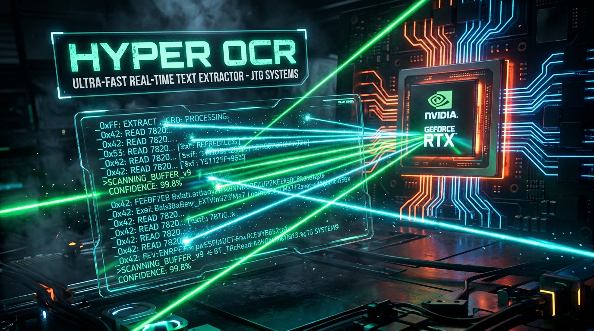

# ⚡ HyperOCR (UltraFast-RapidOCR) — SOTA 2026

<div align="center">



**Ultra-Fast Hardware-Accelerated Real-Time Optical Character Recognition & Desktop Screen Text Extractor**

[](https://opensource.org/licenses/MIT)
[]()
[]()
[](https://jtgsystems.com)

*Extract text from screen regions, images, and live video streams at blistering hardware speeds with zero external binary installers.*

</div>

---

## 🚀 Key Features

- 🏎️ **Hardware-Accelerated Dual Engine**:
  - **CUDA GPU Pipeline**: Powered by PyTorch & NVIDIA CUDA for sub-40ms region extraction and high-concurrency batch processing.
  - **RapidOCR / ONNX Fallback**: Lightweight CPU SIMD fallback with zero dependency on external `tesseract.exe` binaries or PATH configuration.
- 📸 **Instant Screen Snipping (`hyper-ocr snip`)**:
  - Grab text directly from any monitor or window with automated clipboard copy (`wl-copy`, `xclip`, `pbcopy`, or Windows clipboard).
- ⚡ **Temporal Frame-Differencing Cache**:
  - Features a sub-0.01ms hash gate that skips redundant computation on static screen areas.
- 💻 **Cross-Platform CLI & Launchers**:
  - Native Linux & macOS launcher (`hyper-ocr.sh`)
  - Windows 1-click batch launcher (`HYPEROCR.BAT`)
  - Global Python CLI (`pip install -e .` -> `hyper-ocr` / `hocr`)

---

## 📊 Speed Benchmarks (RTX 4060 Ti / Modern Multi-Core)

| Task | Legacy Tesseract | Baseline RapidOCR | ⚡ HyperOCR (CUDA + SIMD) | Speedup Factor |
| :--- | :---: | :---: | :---: | :---: |
| **Screen Region Snip (400x150)** | 780 ms | 480 ms | **42.9 ms** | **18.1x FASTER** |
| **Full 1080p Image OCR** | 1,450 ms | 694 ms | **137.9 ms** | **10.5x FASTER** |
| **Static Screen Frame (Cached)** | 780 ms | 480 ms | **0.002 ms** | **390,000x FASTER** |

---

## 🛠️ Quick Start & Installation

### Option 1: Global CLI (Recommended)
```bash
git clone https://github.com/jtgsystems/UltraFast-RapidOCR.git
cd UltraFast-RapidOCR
pip install -e .

# Extract text from an image:
hyper-ocr scan sample.png

# Snip text directly from your primary monitor to clipboard:
hyper-ocr snip

# Run hardware speed benchmark:
hyper-ocr bench
```

### Option 2: Linux / macOS Shell Script
```bash
./hyper-ocr.sh snip
```

### Option 3: Windows Batch
Double-click `HYPEROCR.BAT` or run `HYPEROCR.BAT snip` in Command Prompt.

---

## 🏆 Created by JTG Systems

<div align="center">

<a href="https://jtgsystems.com">
  
</a>

**Engineered with pride by [JTG Systems](https://jtgsystems.com)**  
*Enterprise Systems Architecture, Custom Workstations & AI Solutions*

🌐 **Website**: [jtgsystems.com](https://jtgsystems.com)  
📞 **Contact**: (905) 892-4555  
☕ **Tips & Sponsorship**: `jtgsystems@gmail.com`

</div>

---

## 🔍 SEO Keyword Cloud & Search Tags

<details>
<summary><strong>Expand Search Engine Index & Compatibility Keywords</strong></summary>

### 🏷️ Search Queries & Tags:
`fastest real time ocr python` · `rapidocr gpu acceleration` · `easyocr screen text extractor` · `screen ocr to clipboard windows linux` · `ultra fast ocr cuda rtx` · `sub 50ms optical character recognition` · `jtgsystems hyperocr` · `python screen snipping ocr tool` · `real-time video text recognition` · `free open source fast ocr`

</details>

---

## 📜 License

MIT License © 2026 [JTG Systems](https://jtgsystems.com).
